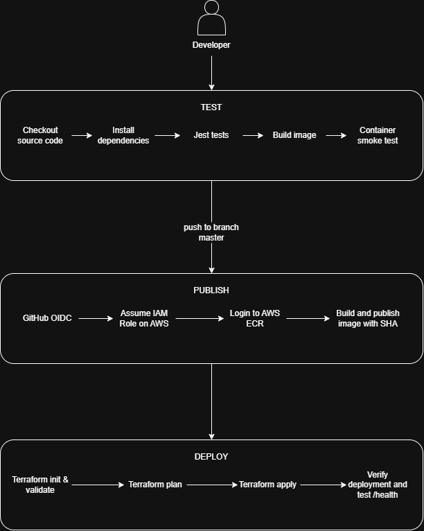
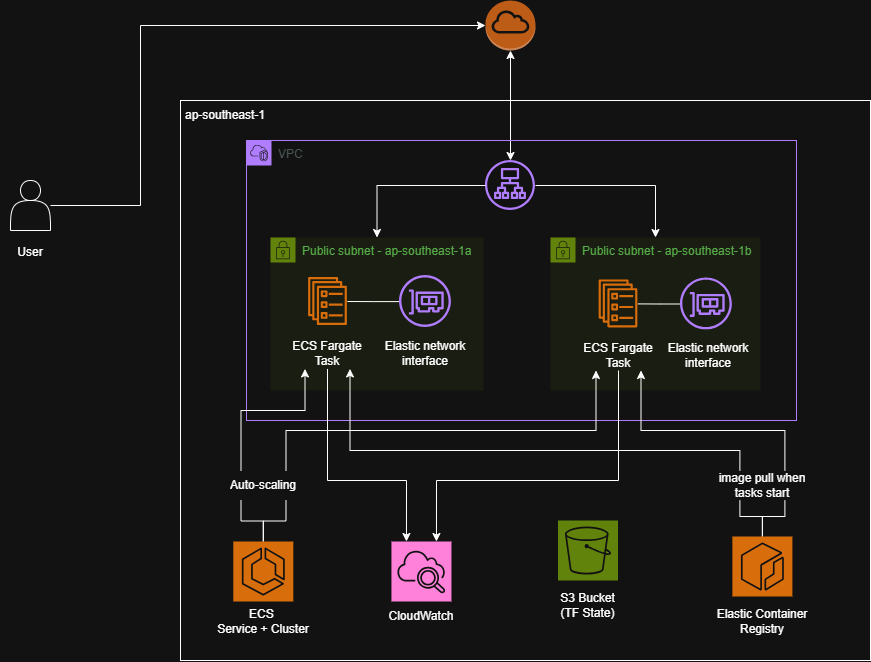

# Golden Owl DevOps Internship Challenge

Node.js application deployed to AWS ECS Fargate through GitHub Actions, with an Application Load Balancer and ECS Service Auto Scaling. Infrastructure is defined in Terraform.


## Application and local development

Prerequisites: Node.js 24, Docker with Linux containers. 

```bash
cd src
npm ci
npm test -- --ci --runInBand
npm start
```

The application serves JSON at `/` and reports readiness at `/health` on port 3000.

From the repository root:

```bash
docker build -t goldenowl:local ./src
docker run --rm -p 3000:3000 goldenowl:local
```

## Container Image Size

Image size: 251402075 bytes

## CI/CD

Workflow: `.github/workflows/ci.yml`.

| Event | Behavior |
|---|---|
| Push to feature branch | Install dependencies, Jest tests, image build, container smoke test |
| Pull request to master | CI checks |
| Push to master | CI, publish image to ECR, deploy with Terraform, verify ECS revision/image and health |

Image tags use the Git commit SHA. ECS task definitions reference an immutable ECR digest. The current workflow builds once for CI and again for publishing; it does not transfer the tested image between runners.

GitHub Actions obtains short-lived AWS credentials through OIDC. Its IAM trust policy is restricted to this repository's actual OIDC subject and deployment branch. New immutable subject formats may include owner/repository numeric IDs. AWS access keys are not committed or stored as long-lived Actions credentials.

GitHub repository variables: `AWS_REGION`, `AWS_ROLE_ARN`, `ECR_REPOSITORY_URL`, `TF_VERSION`.

Deployment checks wait for ECS steady state, compare the deployed task definition and image digest with the intended release, and check `/health`.

## Terraform and infrastructure

| Root module | Responsibility | State key |
|---|---|---|
| `infra/bootstrap` | S3 state bucket, ECR, GitHub OIDC and IAM policies | `bootstrap/terraform.tfstate` |
| `infra/app` | VPC, subnets, security groups, ALB, ECS, execution role, CloudWatch logs, scaling | `app/terraform.tfstate` |

The deployment uses two public subnets in separate Availability Zones, an internet-facing HTTP ALB, and Fargate tasks with public IPs for outbound access. Task inbound port 3000 is allowed only from the ALB security group. There is no NAT Gateway. HTTP is a demo limitation.

Bootstrap using a pre-authorized local AWS identity. Initialize bootstrap locally before creating its S3 bucket, then migrate its state to S3. Account access and authentication are prerequisites; application cloud resources are provisioned by Terraform.

```bash
terraform -chdir=infra/bootstrap init
terraform -chdir=infra/bootstrap plan -out=bootstrap.tfplan
terraform -chdir=infra/bootstrap apply bootstrap.tfplan
```

For a fresh bootstrap, add the S3 backend block only after the bucket exists. After bootstrap and the initial image push:

```bash
terraform -chdir=infra/app init -backend-config=backend.hcl
terraform -chdir=infra/app plan -var="image_uri=ECR_URI@sha256:DIGEST" -out=app.tfplan
terraform -chdir=infra/app apply app.tfplan
```

## Workflow and architecture diagrams

### CI/CD workflow

On every push, GitHub Actions installs dependencies, runs the Jest tests, builds the Docker image, and starts a container to check the `/health` endpoint. Pull requests targeting `master` run these CI checks as well. Publishing and deployment run only for a push to `master` or a manual workflow dispatch on `master`, and only after the tests pass.

The publish job uses GitHub OIDC to assume the AWS IAM role, then builds and pushes the commit-tagged image to ECR. The deploy job resolves that image to its immutable digest and passes it to Terraform, which updates the ECS task definition and service. It then verifies the ECS rollout, confirms the task is using the intended image, and checks the application's health endpoint.



### AWS architecture

User HTTP traffic reaches the internet-facing Application Load Balancer in the VPC's public subnets. The ALB forwards requests on port 3000 to healthy ECS Fargate tasks in two Availability Zones. The tasks send application logs to CloudWatch Logs, and ECS Service Auto Scaling adjusts the number of running tasks between the configured minimum and maximum based on the ALB request count per target.

During deployment, GitHub Actions authenticates to AWS through the GitHub OIDC provider and a restricted IAM role, then publishes the container image to ECR. ECS tasks pull the image from ECR when starting. Terraform provisions and manages the AWS infrastructure; the S3 bucket stores Terraform state.



## Resource
- Successful CI/CD run: [[View GitHub Actions run]](https://github.com/thaodinh97/goldenowl-devops-internship-challenge/actions/runs/37196142928/job/111419982843)
- Deployment link: http://goldenowl-devops-alb-897335286.ap-southeast-1.elb.amazonaws.com/
- URL of my GitHub repository: https://github.com/thaodinh97/goldenowl-devops-internship-challenge 